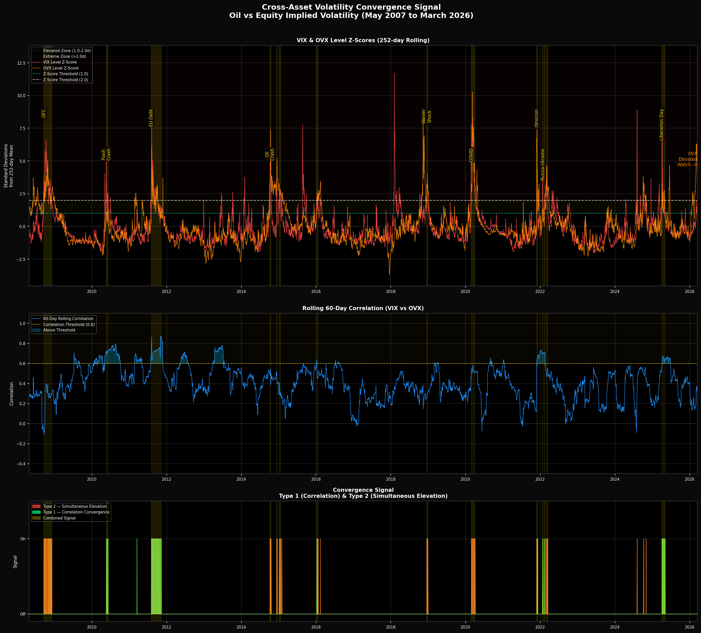
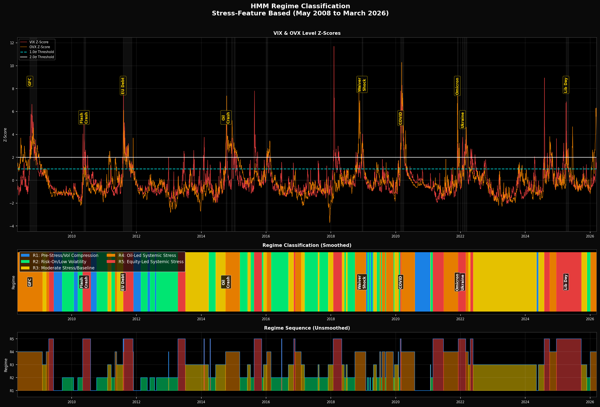
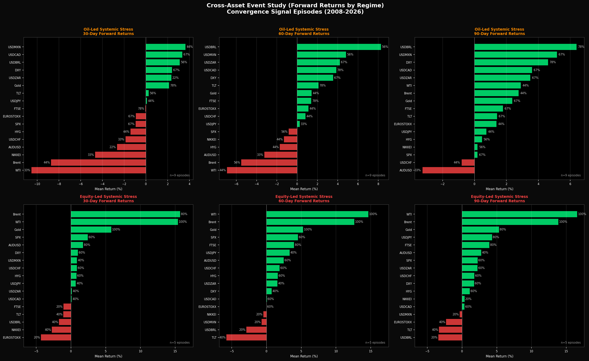
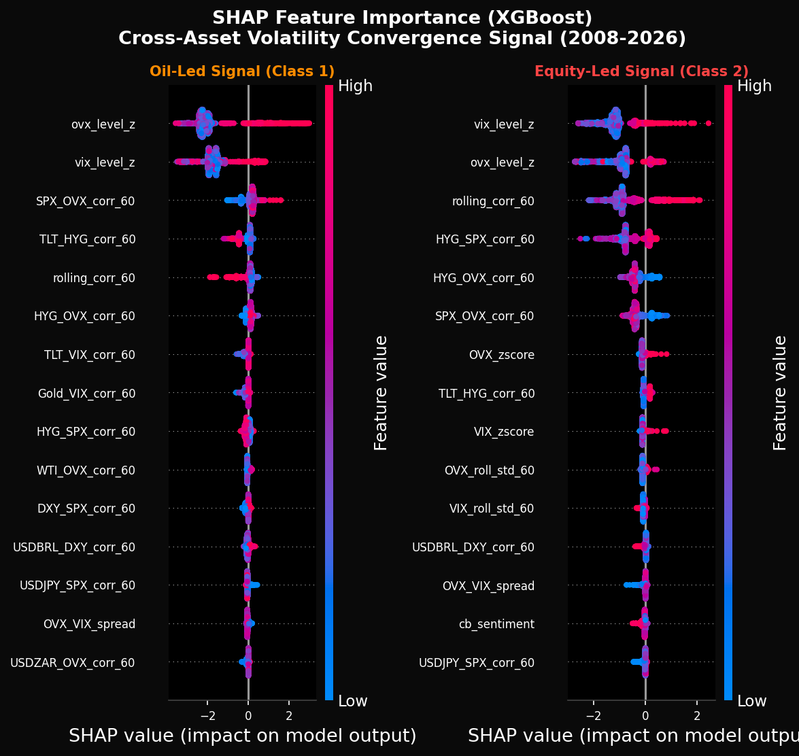

# Cross-Asset Volatility Convergence
## A Regime-Conditional Macro Playbook (2008 - 2026)

> *When oil volatility and equity volatility converge above a critical 
> threshold, does the nature of the leading stress, oil-led vs 
> equity-led, determine the subsequent cross-asset response?*

This project began with a Bloomberg chart. In early 2026, as the Iran 
conflict escalated, crude oil 25-delta call volatility and SPX put 
volatility were converging in a way that looked historically significant. 
This framework was built to answer what that convergence means, and 
what to do about it.

**The answer to the question, validated across 18 years of data and 14 convergence 
episodes, is yes. The nature of the leading stress determines 
everything.**

---

## The Core Finding

The same asset produces opposite signals depending on which volatility 
measure leads:

| Asset | Oil-Led Stress (30d) | Hit Rate | Equity-Led Stress (30d) | Hit Rate |
|-------|---------------------|----------|------------------------|----------|
| WTI | -10.52% | 33% | +15.39% | 100% |
| Gold | +2.13% | 78% | +5.80% | 100% |
| TLT | +0.26% | 56% | -1.10% | 40% |
| DXY | +2.40% | 67% | +1.00% | 60% |
| NIKKEI | -4.67% | 33% | -2.76% | 40% |
| USDBRL | +3.11% | 56% | -1.73% | 40% |

**Getting the regime wrong means executing the opposite trade.**

---

## Live Signal - Iran Crisis (2026)

The convergence signal activated on **March 6th 2026**, correctly 
identifying an oil-led stress environment during the Iran conflict. 
Adjusted directional accuracy of **77%** across non-structurally 
distorted assets. The supply disruption nature of the conflict (mirroring 
the Russia-Ukraine parallel within the dataset) inverted the WTI and 
Brent signals, validating the framework's ability to identify where 
current episodes diverge from historical precedent.

---

## Visualisations

### Convergence Signal - VIX & OVX Z-Scores (2008 - 2026)


### HMM Regime Classification


### Cross-Asset Event Study - Forward Returns by Regime


### SHAP Feature Importance


---

## Methodology

### 1. Data
- 23 assets across equities, fixed income, commodities, FX and credit
- Daily data May 2007 - March 2026 (4,916 rows) via yfinance
- Assets: SPX, FTSE, EuroStoxx, Nikkei, Gold, TLT, WTI, Brent, 
  OVX, VIX, HYG, DXY, US10Y and 10 currency pairs

### 2. Convergence Signal
- **Type 1:** 60-day VIX/OVX rolling correlation > 0.6 AND both 
  Z-scores > 1.0σ
- **Type 2:** Both 252-day rolling Z-scores > 2.0σ simultaneously
- 14 episodes identified (5-day gap tolerance, 5-day minimum duration)

### 3. Regime Classification
- 5-state Hidden Markov Model trained on 8 stress features
- **Regime 4 - Oil-Led Systemic Stress:** OVX leading VIX (9 episodes)
- **Regime 5 - Equity-Led Systemic Stress:** VIX leading OVX (5 episodes)

### 4. Central Bank Sentiment Layer
- 154 FOMC statements (2008-2026) scored via ProsusAI/FinBERT
- Rate decisions and basis points sourced from FRED API
- Forward-filled daily across 4,662 trading days

### 5. Event Study
- 17 assets × 14 episodes × 3 horizons (30/60/90 days)
- 714 total observations
- Hit rates calculated per asset per regime

### 6. Model Comparison
- Logistic Regression baseline vs XGBoost + SHAP
- Three-class target: No Signal (95.1%) · Oil-Led (2.8%) · 
  Equity-Led (2.1%)
- Walk-forward validation across three expanding windows
- XGBoost Split 2 Oil-Led F1: **0.97** | Equity-Led F1: **0.82**

---

## Key SHAP Findings

- **ovx_level_z and vix_level_z** are the dominant predictors across 
  both regimes — Z-scores carry the primary predictive weight
- **rolling_corr_60** is 6x more important for equity-led signal 
  activation — equity stress requires sustained co-movement (mean 0.697) 
  vs oil-led episodes where OVX spikes independently (mean 0.393)
- **HYG_SPX_corr_60** is 7x more important for equity-led stress — 
  credit/equity coupling is the defining signature of financial contagion
- **cb_sentiment** shows asymmetric importance (0.036 equity-led vs 
  0.004 oil-led) — equity stress is more policy-sensitive than oil 
  supply shocks
- Every methodological choice confirmed by independent feature 
  importance rankings

---

## Repository Structure
```
├── cross_asset_convergence.ipynb   # Full analysis notebook
├── cross_asset_vol_convergence.pdf # Summary research note
├── data/
│   ├── cross_asset_clean.csv       # Clean price data (4,916 rows × 23 assets)
│   ├── cross_asset_log_returns.csv # Log returns
│   ├── convergence_episodes.csv    # 14 detected episodes
│   ├── features_complete.csv       # Full feature set (4,662 rows × 38 cols)
│   ├── event_study_results.csv     # 714 observations
│   ├── event_study_summary.csv     # Aggregated returns and hit rates
│   └── cb_statements/
│       ├── fomc_sentiment.csv      # 154 FOMC statements scored
│       └── fomc_complete.csv       # Sentiment + FRED rate data merged
├── images/
│   ├── convergence_signal.png
│   ├── regime_classification.png
│   ├── event_study_returns.png
│   └── shap_beeswarm.png
└── README.md
```

---

## Dependencies
```python
pip install pandas numpy matplotlib seaborn yfinance scikit-learn 
pip install xgboost shap hmmlearn transformers torch 
pip install pandas-datareader requests beautifulsoup4 tqdm
```

---

## Limitations

- Small signal sample (228 days across 18 years) limits model 
  statistical power, results are directional evidence not 
  high-confidence predictions
- FOMC sentiment only: ECB, BOJ and BOE scraping encountered 
  JavaScript rendering limitations
- Supply disruption episodes (Russia-Ukraine, Iran war) require 
  separate conditioning from demand destruction episodes
- All data sourced via yfinance: production implementation would 
  use Bloomberg Data License or Refinitiv Eikon

---

## Author

**Israel Olujobi**  
EM FX Trader (Bank of America, 2023–2025) | Cambridge Data Science & AI  
[LinkedIn](https://linkedin.com/in/israel-olujobi) · 
[Email](mailto:israeljobi351@yahoo.com)

---

*Full methodology and live signal assessment in the 
[summary research note](cross_asset_vol_convergence.pdf)*
